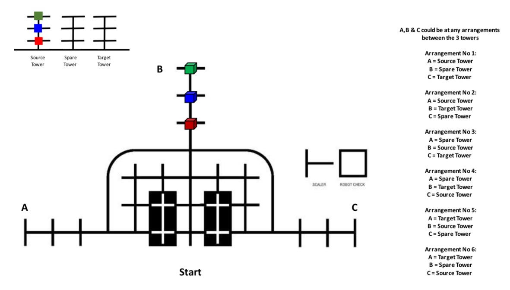
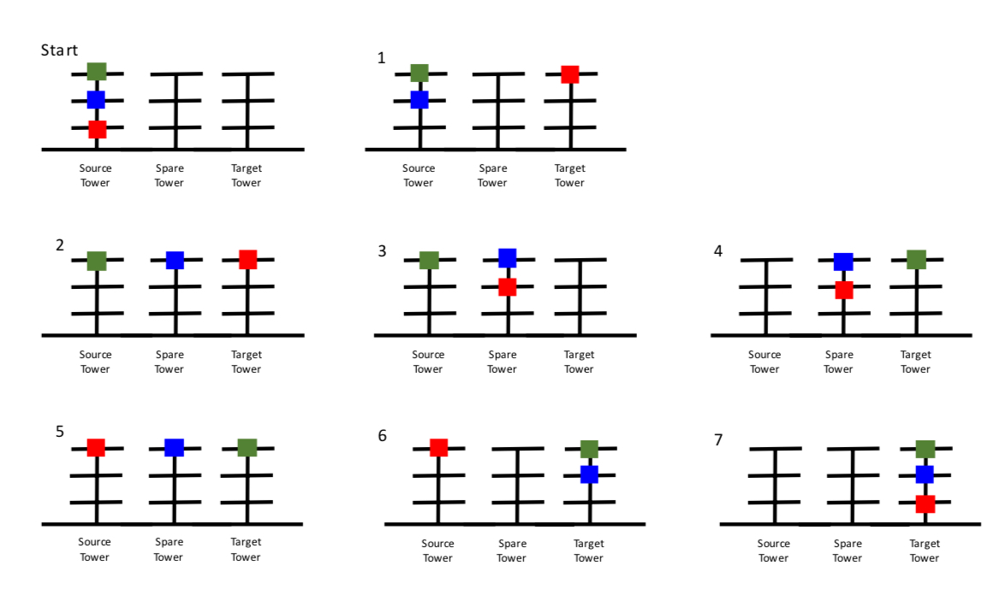

# rbtx-tracerbot
This repository contains the code and full documentation for TSU, my team's (SDAR RoboKnights) submission for Petrosains' RBTX Challenge 2022, advanced line tracing category.

## About the competition
The robot's mission is to shift the mission items one-by-one from the Source Tower to the Target Tower, while obeying the rules of the Tower of Hanoi (3,3). The robot with the fastest completion time is the winner.

There are no rules regulating the type of robot to be used, in this case I am building my own.

More information is available at [the Petrosains website.](https://petrosains.com.my/rbtx-challenge-2022/assets/rules/tracer/Robo%20Tracer%20Advance%20Rules%20&%20Regulations.pdf)

## The map
The map is composed of 3 "Towers" on which the mission items (green, yellow and red cubes) will be placed on, the Start Zone, and a line matrix. The locations of the towers may change. The robot will start at the Start Zone, and move to a defined Source Tower to shift the cubes to a Target Tower through a Spare Tower.

The robot must always abide by the rules of the Tower of Hanoi (3,3). The shortest sequence contains 7 moves and is as follows:

